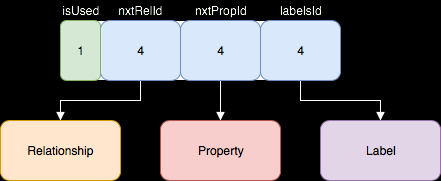
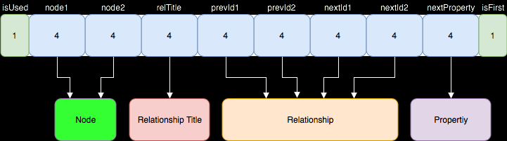
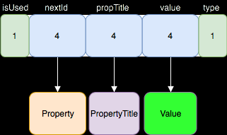

# Bubba DB - graph database, developed with Go programming language
Project is developed as an assignment for Advanced Databases course in Innopolis University

## DB Storage structure
Node storage:



Relationship storage:



Property storage:



## Requirements
Apple macOS: Install [Go](https://storage.googleapis.com/golang/go1.9.darwin-amd64.pkg)

Microsoft Windows: Install [Go](https://storage.googleapis.com/golang/go1.9.windows-amd64.msi)

Linux: Install [Go](https://storage.googleapis.com/golang/go1.9.linux-amd64.tar.gz)

### Installation
```bash
$ git clone https://github.com/KKhanda/graph-db.git
```

### Building and running the application
```bash
$ go build ./cmd/graph-db/
$ ./graph-db
```

### Running tests
```bash
$ go test ./... -cover
```

## API description
Example of API usage is attached in "main.go" file.

API calls are described in package "/api" in "storage-controller.go" file:

* `api.CreateDatabase` - takes two parameters: database title and db mode ("local", "distributed")
* `api.SwitchDatabase` - parameter is database title. Switches only if database exist.
* `api.DropDatabase` - parameter is database title. Drops database if it exists.
* `api.CreateNode` - parameter is title/label of node. Creates new node and writes it into database.
* `api.CreateRelationship` - takes three parameters: pointer on two nodes, which are in relationships
 and title of relationship. Method created a new relationship for two nodes.
* `api.CreatePropertyForNode` - takes four parameters: pointer on node, title of property,
type of property value and value itself. Value type could be the following: 0 - integer, 1 - double, 2 - string.
Method creates a property for a given node.
* `api.CreatePropertyForRelationship` - same parameters as in previous method. Creates a property for given relationship.
* `api.GetNode` - parameter is id of searched node. Returns pointer on node, which is searched by id.
* `api.DeleteNode` - parameter is id of node, which should be deleted. Sets node as deleted in database.

