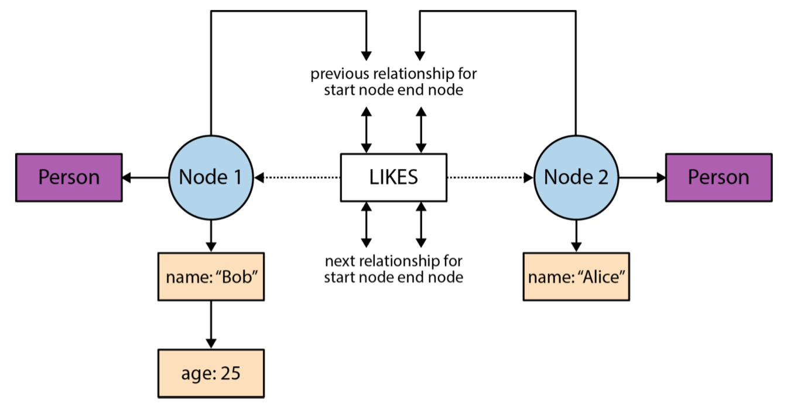

# Graph DB Go implementation
Project is developed as an assignment for Advanced Databases course in Innopolis University

## DB Storage structure


## Requirements
Apple macOS: Install [Go](https://storage.googleapis.com/golang/go1.9.darwin-amd64.pkg)

Microsoft Windows: Install [Go](https://storage.googleapis.com/golang/go1.9.windows-amd64.msi)

Linux: Install [Go](https://storage.googleapis.com/golang/go1.9.linux-amd64.tar.gz)

### Installation
```bash
$ git clone https://github.com/KKhanda/graph-db.git
```

### Building and running the application
```bash
$ go build ./cmd/graph-db/
$ ./graph-db
```

